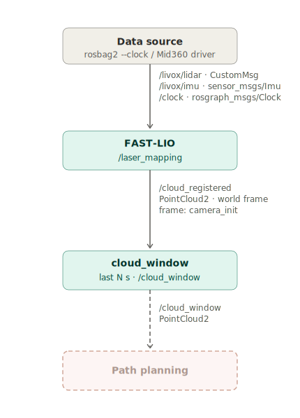

# Rolling Point-Cloud Window from Fast-LIO2 Output
This document covers republishing the last N seconds of the point cloud produced by Fast-LIO2 as a single rolling-window cloud using [`cloud_window.py`](../cloud_window.py) node. It reproduces the effect of RViz's *Decay Time* setting — a dense view of the recent past that follows the boat.

> [!NOTE]
> Fast-LIO2 must already be built and configured in your ROS 2 workspace as described in [`FastLIO2.md`](FastLIO2.md).

## 1. Prerequisites
* **ROS 2 Humble** on Ubuntu 22.04 (see [`LivoxMid360.md`](LivoxMid360.md))
* **Fast-LIO2** (compiled in your ROS 2 workspace, e.g., `~/ws`, see [`FastLIO2.md`](FastLIO2.md))
* **A data source**: either the Livox Mid-360 running live, or a recorded bag file in CustomMsg format (see [`FastLIO2.md`](FastLIO2.md), section 4). This guide uses a recorded bag.
* **Python 3 with NumPy** — already present in a ROS 2 Humble desktop install (used only for the optional height crop).

## 2. How It Works
Fast-LIO2 publishes every registered scan on `/cloud_registered` in the world frame (`camera_init`). A single scan on its own is sparse, while the fully accumulated map keeps every scan forever — it grows without bound and slowly smears as odometry drifts. For docking we want something in between: a dense but *fresh* local view of the last few seconds around the boat.

RViz can already fake this with a PointCloud2 display's **Decay Time**, but that only changes what one RViz client draws — nothing else on the system sees an accumulated cloud. [`cloud_window.py`](../cloud_window.py) moves that behavior server-side:

1. It subscribes to `/cloud_registered` and keeps every scan received in the last `window_sec` seconds in a buffer.
2. On a fixed timer (`publish_rate` Hz) it concatenates the buffered scans and publishes them as a single `PointCloud2` on `/cloud_window`, in the same world frame. Because every Fast-LIO2 scan has an identical field layout, the scans are joined by raw byte concatenation — no per-point parsing.
3. Older scans fall out of the buffer as newer ones arrive, so the output is always the most recent `window_sec` seconds — a rolling window that follows the boat without ever accumulating the whole map.
4. An optional height crop (`min_z` / `max_z`, world frame) drops points above or below given heights — mainly to remove water-surface mirror reflections below the waterline.

The window is trimmed relative to the newest **data** timestamp, not wall-clock time, so it behaves identically on the live sensor and on bag playback with `--clock`; a backwards time jump (a bag restart) clears the buffer automatically.



## 3. Installation
There are no packages to install — the node is a single self-contained script, [`cloud_window.py`](../cloud_window.py), included in this repository. Copy it into your workspace:
```bash
cp src/cloud_window.py ~/ws/
```
Its only third-party dependency is NumPy, which ships with the ROS 2 Humble desktop install. If it is missing:
```bash
sudo apt install python3-numpy -y
```

## 4. Configuration
The node is configured from the command line. Every flag also has a ROS 2 parameter equivalent that **takes precedence** when passed via `--ros-args -p`, so the same script works standalone and under launch files (and picks up `use_sim_time` for bag playback).

| CLI flag | ROS parameter | Default | Meaning |
| --- | --- | --- | --- |
| `--window` | `window_sec` | `5.0` | Length of the rolling window in seconds — the equivalent of RViz's Decay Time. |
| `--rate` | `publish_rate` | `2.0` | Rate (Hz) at which `/cloud_window` is republished. |
| `--min-z` | `min_z` | off | Drop points below this z (world frame, m). Use to remove reflections below the waterline. |
| `--max-z` | `max_z` | off | Drop points above this z (world frame, m). |

Key points when adapting these values:

* **`--window`** is the single most important knob. Short windows (2–5 s) clear moving obstacles quickly but produce sparser clouds; long windows (10–20 s) build a dense local map but keep moving objects visible longer and let odometry drift smear the cloud. For docking, **10 s** is a good starting point.
* **`--rate`** only controls how often the accumulated window is re-emitted; it does not change the window contents. Raise it for smoother visualization, lower it if a large window makes republishing expensive.
* **Height crop is in the world frame `camera_init`**, whose origin sits wherever Fast-LIO2 started — if the boat did not start level, `z = 0` is *not* the waterline. Pick `--min-z` from the actual data (e.g. `-1.0`) rather than assuming `0`. Passing no crop flags disables the filter entirely, so the raw cloud is republished untouched.

> [!NOTE]
> `use_sim_time` is only for bag playback. Pass `--ros-args -p use_sim_time:=true` while replaying a bag (the same as `--clock` on the player); when running with the live sensor, omit it so the node follows the system clock.

## 5. Running the Pipeline
Four terminals are used: Fast-LIO2, the cloud window node, RViz, and bag playback. Source your workspace (`source ~/ws/install/setup.bash`) in each of them.

### 5.1 Launch Fast-LIO2 (Terminal 1)
Launch Fast-LIO2 without its own RViz — a dedicated RViz is started in [section 5.3](#53-launch-rviz-terminal-3) so it can be configured for `/cloud_window`:
```bash
ros2 launch fast_lio mapping.launch.py config_file:=mid360.yaml use_sim_time:=true rviz:=false
```
The node starts and waits for data.

### 5.2 Launch the Cloud Window Node (Terminal 2)
```bash
python3 ~/ws/cloud_window.py --window 10 --min-z -1.0  --ros-args -p use_sim_time:=true
```
On startup it logs the active settings (`window=10.0s rate=2.0Hz z=[-1.0, 1000.0]`) and then stays quiet until scans arrive on `/cloud_registered`.

### 5.3 Launch RViz (Terminal 3)
```bash
rviz2
```
Set the **Fixed Frame** to `camera_init` and add a **PointCloud2** display on `/cloud_window` (see [section 5.5](#55-visualizing-the-cloud-window)).

### 5.4 Play the Recording (Terminal 4)
```bash
ros2 bag play datasets/recording_lake_2 --clock
```
As soon as playback starts, Fast-LIO2 begins publishing `/cloud_registered`, the cloud window node fills its buffer, and `/cloud_window` starts publishing.

### 5.5 Visualizing the Cloud Window
In RViz, set the **Fixed Frame** to `camera_init` and add a **PointCloud2** display with its topic set to `/cloud_window`. You should see a dense point cloud of the last ~10 s of surroundings (shore, dock, other vessels) that follows the boat, staying fresh instead of accumulating the entire map. Leave the display's own **Decay Time** at `0` — the accumulation now happens in the topic itself. To compare against the raw sensor stream, add a second PointCloud2 display on `/cloud_registered`; it will look markedly sparser per frame.

## 6. Troubleshooting
* **`/cloud_window` is never published:** Confirm `/cloud_registered` is alive (`ros2 topic hz /cloud_registered`). If it is silent, the problem is upstream — Fast-LIO2 is not producing odometry (see [`FastLIO2.md`](FastLIO2.md)).
* **Node runs but nothing comes out during bag playback:** A `use_sim_time` / `--clock` mismatch. If the node is started with `use_sim_time:=true` but the bag is played **without** `--clock` (or vice versa), the node's clock never advances and the publish timer never fires. Keep the two consistent.
* **Nothing appears in RViz although `/cloud_window` publishes:** The **Fixed Frame** must be `camera_init` (the frame of `/cloud_window`); any other frame leaves the display empty.
* **The cloud looks too sparse:** Increase `--window` for a longer, denser accumulation.
* **Moving obstacles leave a smear/trail behind them:** Decrease `--window` so old positions leave the buffer faster.
* **Ghost points / a mirror image appear below the boat:** Water-surface reflections. Set `--min-z` (e.g. `-1.0`) to crop everything below the waterline; adjust the value from the actual data since `z = 0` is Fast-LIO2's start height, not the waterline.
* **Republishing lags or stutters:** Lower `--rate`, or reduce `--window` — a very large window makes each concatenation more expensive.
* **`Time jump detected, buffer cleared` warnings:** Expected whenever the clock jumps backwards, e.g. when a bag loops or is restarted. The buffer is dropped and refills on the next scans; it is harmless.
