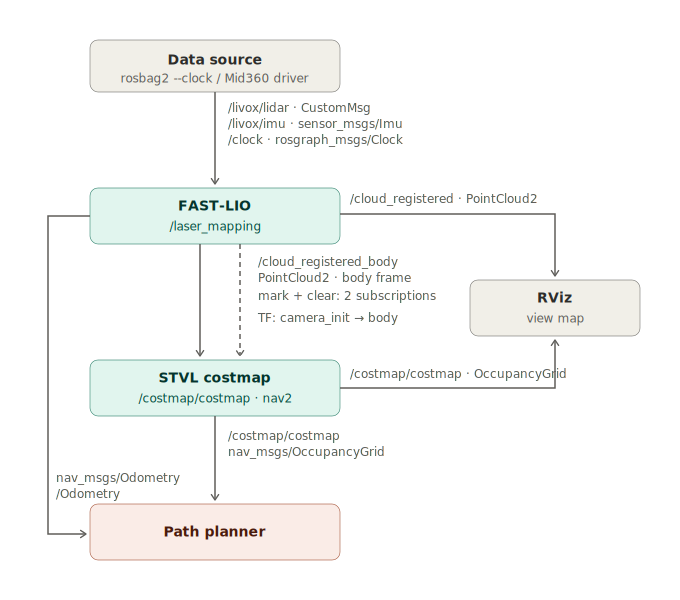

# 2D Costmap Generation from Fast-LIO2 Output
This document covers generating a live 2D costmap for docking and navigation from the point cloud produced by Fast-LIO2, using Nav2's `nav2_costmap_2d` together with the Spatio-Temporal Voxel Layer (STVL): installing the packages, configuring the costmap node, running the full pipeline on a recorded bag file, and troubleshooting.

> [!NOTE]
> Fast-LIO2 must already be built and configured in your ROS 2 workspace as described in [`FastLIO2.md`](FastLIO2.md).

## 1. Prerequisites
* **ROS 2 Humble** on Ubuntu 22.04 (see [`LivoxMid360.md`](LivoxMid360.md))
* **Fast-LIO2** (compiled in your ROS 2 workspace, e.g., `~/ws`, see [`FastLIO2.md`](FastLIO2.md))
* **A data source**: either the Livox Mid-360 running live, or a recorded bag file in CustomMsg format (see [`FastLIO2.md`](FastLIO2.md), section 4). This guide uses a recorded bag.

## 2. How It Works
The pipeline builds on the topics and TF frames that Fast-LIO2 already publishes:

1. Fast-LIO2 publishes the registered scan in the body frame on `/cloud_registered_body` and provides the TF tree `camera_init` (world) → `body` (robot).
2. The **STVL layer** consumes this point cloud twice: once as a *marking* source that fills 3D voxels with obstacles, and once as a *clearing* source that empties voxels inside the sensor frustum. Voxels outside the frustum decay over time instead of disappearing instantly, which keeps temporarily occluded static obstacles (like a dock) on the map.
3. The occupied voxel columns are projected down into a 2D rolling-window costmap centered on the boat.
4. The **inflation layer** adds a cost gradient around lethal cells so a planner can keep a safe distance instead of grazing obstacles.



## 3. Installation
Both packages are available as Humble binaries:
```bash
sudo apt install ros-humble-spatio-temporal-voxel-layer ros-humble-nav2-costmap-2d -y
```

## 4. Configuration
Create the parameter file `~/ws/costmap.yaml` with the following content:
```yaml
/**:
  ros__parameters:
    use_sim_time: true              # clock comes from the bag (--clock required)
    global_frame: camera_init       # FAST-LIO world frame (switch to map if gravity script returns)
    robot_base_frame: body          # FAST-LIO body frame
    transform_tolerance: 0.3        # allowed TF latency (s)
    update_frequency: 5.0           # map update rate (Hz)
    publish_frequency: 2.0          # publish rate (Hz)
    rolling_window: true            # map follows the boat, no accumulation
    width: 50                       # window size (m) — enough for docking, 100 = 4x CPU
    height: 50
    resolution: 0.1                 # 2D cell size (m)
    robot_radius: 0.55              # sqrt((L/2)^2 + (W/2)^2) + margin
    always_send_full_costmap: true  # publish full grid each cycle (simpler for planner)
    plugins: ["stvl_layer", "inflation_layer"]

    stvl_layer:
      plugin: "spatio_temporal_voxel_layer/SpatioTemporalVoxelLayer"
      voxel_decay: 50.0             # lifetime (s) of voxels OUTSIDE the sensor frustum — static persistence
      decay_model: 0                # 0 = linear decay
      voxel_size: 0.1               # 3D voxel edge (m); keep >= resolution
      mark_threshold: 2             # >=2 occupied voxels per column = obstacle; drop to 1 if low objects get missed
      publish_voxel_map: false      # set true for debugging
      transform_tolerance: 0.3
      observation_sources: mark clear
      mark:                         # source that FILLS cells
        data_type: PointCloud2
        topic: /cloud_registered_body
        marking: true
        clearing: false
        min_obstacle_height: -1.0   # covers init-tilt offset; with gravity script use water + 0.10
        max_obstacle_height: 5.0    # above this the boat cannot collide anyway
        obstacle_range: 30.0        # marking range — keep equal to clear max_z
      clear:                        # source that EMPTIES cells (sensor frustum)
        data_type: PointCloud2
        topic: /cloud_registered_body
        marking: false
        clearing: true
        model_type: 1               # 3D lidar frustum
        vertical_fov_angle: 1.03    # Mid360 vertical FOV ~59 deg (rad)
        vertical_fov_padding: 0.1
        horizontal_fov_angle: 6.29  # 360 deg
        decay_acceleration: 2.0     # in-frustum clearing speed — raise if trails linger, lower if occluded statics vanish
        min_z: 0.0                  # frustum lower bound
        max_z: 30.0                 # frustum range ~= clearing distance
    inflation_layer:
      plugin: "nav2_costmap_2d::InflationLayer"
      inflation_radius: 0.60        # must exceed robot_radius; gap below one cell = no gradient (0.56 kills it)
      cost_scaling_factor: 8.0      # higher = steeper, thinner ring
```

Key points when adapting this file:

* **Frames**: `global_frame` and `robot_base_frame` must match the TF frames published by Fast-LIO2 (`camera_init` and `body` by default).
* **Window size**: `width`/`height` define the rolling window in meters. 50 m is enough for docking; doubling it to 100 m roughly quadruples the CPU load.
* **`robot_radius`**: computed from the vessel footprint as `sqrt((L/2)² + (W/2)²)` plus a safety margin.
* **`voxel_decay` vs `decay_acceleration`**: `voxel_decay` controls how long obstacles *outside* the current sensor view survive (static persistence), while `decay_acceleration` controls how fast cells *inside* the frustum are cleared. Raise `decay_acceleration` if moving obstacles leave trails; lower it if occluded static obstacles vanish too quickly.
* **`inflation_radius`**: must exceed `robot_radius` by at least one cell (`resolution`), otherwise no cost gradient is generated at all — e.g., with `robot_radius: 0.55` and `resolution: 0.1`, a value of 0.56 silently kills the gradient.

> [!NOTE]
> `use_sim_time: true` is only for bag playback. When running with the live sensor, set it to `false` (and skip `--clock`/`use_sim_time` everywhere below).

## 5. Running the Pipeline
Four terminals are used: Fast-LIO2, the costmap node, its lifecycle activation, and bag playback. Source your workspace (`source ~/ws/install/setup.bash`) in each of them.

### 5.1 Launch Fast-LIO2 (Terminal 1)
```bash
ros2 launch fast_lio mapping.launch.py config_file:=mid360.yaml use_sim_time:=true
```
RViz opens and waits for data.

### 5.2 Launch the Costmap Node (Terminal 2)
```bash
ros2 run nav2_costmap_2d nav2_costmap_2d --ros-args --params-file ~/ws/costmap.yaml
```
The node starts in the **unconfigured** lifecycle state and does nothing yet — this is expected.

### 5.3 Activate the Costmap Node (Terminal 3)
`nav2_costmap_2d` is a lifecycle node. Normally the Nav2 lifecycle manager would bring it up; since we run it standalone, we transition it manually:
```bash
export LD_LIBRARY_PATH=/opt/ros/humble/opt/openvdb_vendor/lib:$LD_LIBRARY_PATH
ros2 lifecycle set /costmap/costmap configure && ros2 lifecycle set /costmap/costmap activate
```

> [!IMPORTANT]
> The `LD_LIBRARY_PATH` export is required because STVL depends on the vendored OpenVDB library, which is not on the default library path. Without it the node crashes during `configure` with an OpenVDB shared-library error.

### 5.4 Play the Recording (Terminal 4)
```bash
ros2 bag play datasets/recording_lake_2 --clock
```
As soon as playback starts, Fast-LIO2 begins mapping and the costmap node starts publishing on `/costmap/costmap`.

### 5.5 Visualizing the Costmap
In the RViz window opened by Fast-LIO2, add a **Map** display and set its topic to `/costmap/costmap`. You should see a 50 x 50 m occupancy grid following the boat, with lethal cells on obstacles (shore, dock, other vessels) and an inflation ring around them. For debugging the 3D voxel grid itself, set `publish_voxel_map: true` in the STVL config and add a **PointCloud2** display on the voxel topic.

## 6. Troubleshooting
* **Costmap node dies during `configure` with an OpenVDB library error:** The `LD_LIBRARY_PATH` export from [section 5.3](#53-activate-the-costmap-node-terminal-3) is missing in that terminal.
* **Costmap stays empty:** Check that the transitions in [section 5.3](#53-activate-the-costmap-node-terminal-3) succeeded (`ros2 lifecycle get /costmap/costmap` should report `active`), that `/cloud_registered_body` is being published (`ros2 topic hz /cloud_registered_body`), and that the bag was started with `--clock` — without it, `use_sim_time: true` leaves the node waiting for a clock that never comes.
* **`Timed out waiting for transform` warnings:** TF from `camera_init` to `body` is late or missing. Verify Fast-LIO2 is running and publishing odometry; if the warnings are sporadic, increase `transform_tolerance`.
* **Moving obstacles leave trails behind them:** Increase `decay_acceleration` in the `clear` source.
* **Static obstacles disappear when occluded or out of view:** Increase `voxel_decay`, or lower `decay_acceleration` if they vanish while still inside the frustum.
* **Low objects are not marked:** Drop `mark_threshold` to 1, or lower `min_obstacle_height`.
* **No inflation gradient around obstacles:** `inflation_radius` is too close to `robot_radius` — it must exceed it by at least one cell (see [section 4](#4-configuration)).
